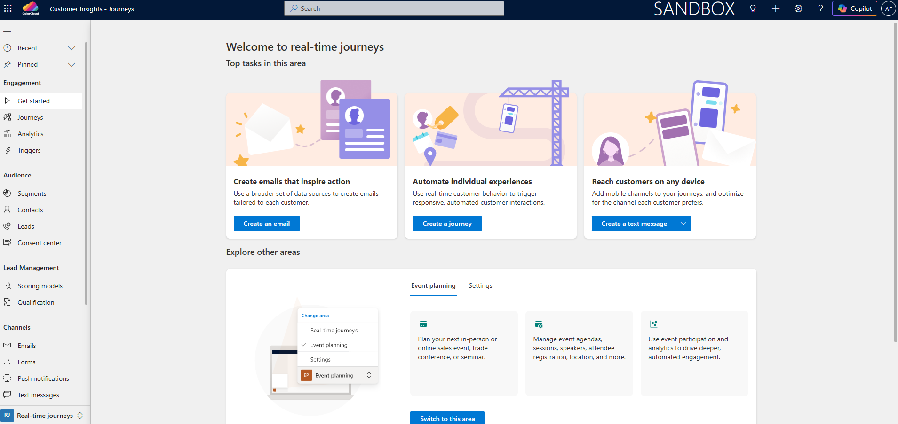
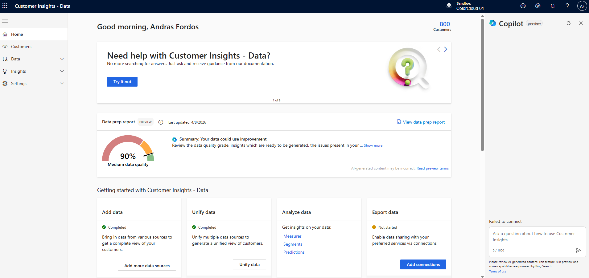
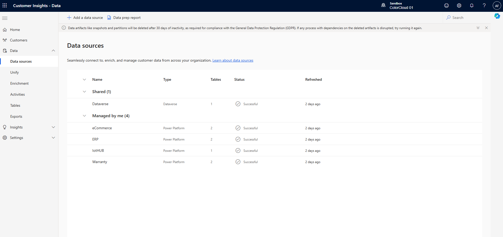
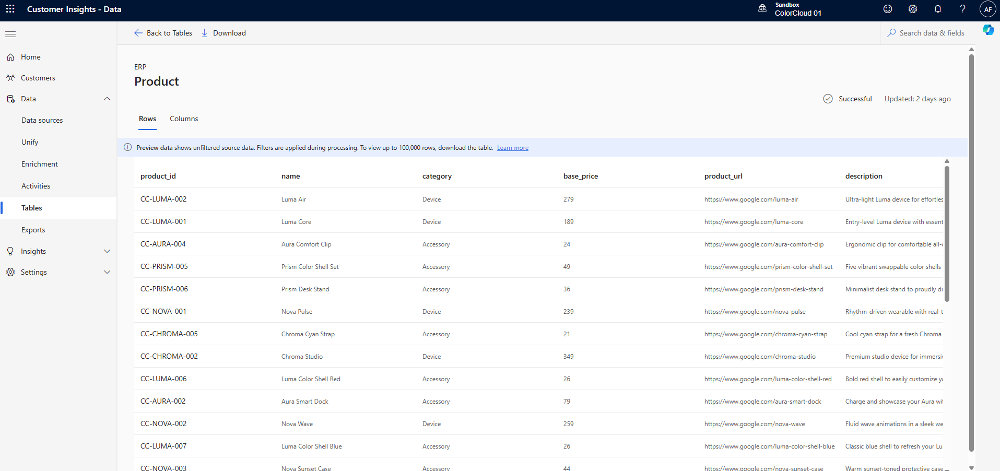
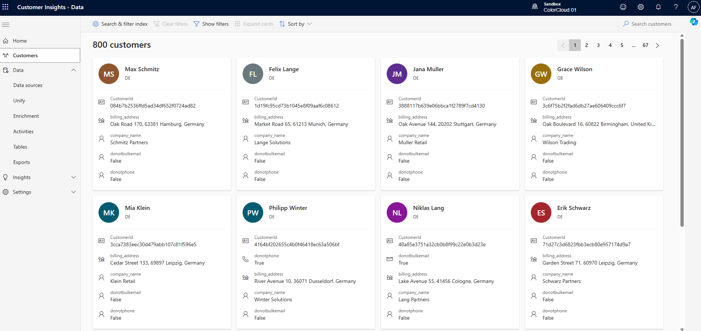
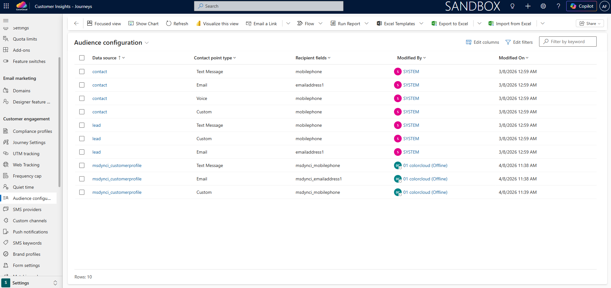
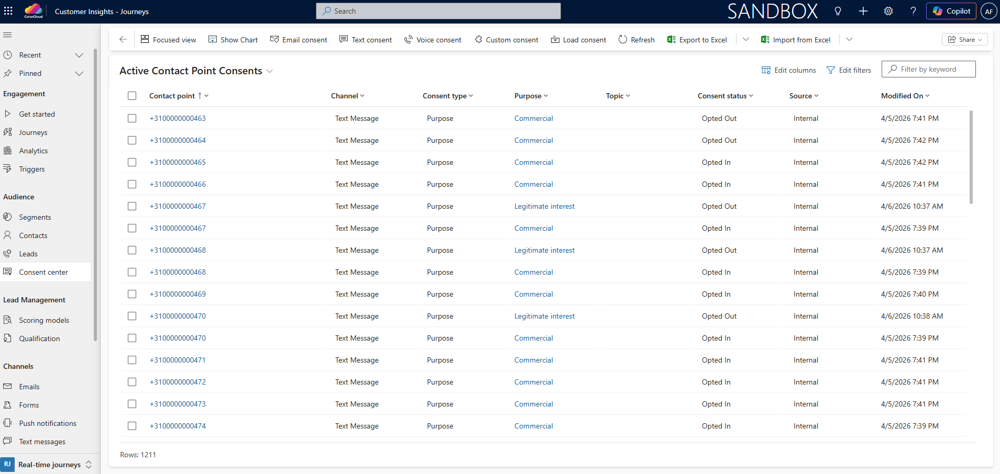
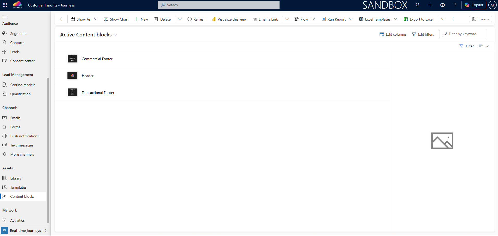

# Lab 1: Access Environment & Finalize Configuration

[Reading time: 6 min]

[Lab time: 25 min]

- [Lab Overview](#lab-overview)
- [Exercise 1: Sign in to Customer Insights - Journeys](#exercise-1-sign-in-to-customer-insights---journeys)
- [Exercise 2: Verify Preconfigured CI-D Components](#exercise-2-verify-preconfigured-ci-d-components)
- [Exercise 3: Verify Preconfigured CI-J Components](#exercise-3-verify-preconfigured-ci-j-components)

# Lab Overview
## Introduction
In this lab, you will access the Dynamics 365 Customer Insights environments and we will review the setup prepared for the workshop together. We will verify key configurations across `CI-D` and `CI-J` to make sure everything is ready for building Maya's end-to-end customer experience.

## Objectives
By the end of this lab, you will be able to:
- Access the `CI-D` and `CI-J` environments
- Familiarize yourself with and verify the preconfigured components
- Ensure your environment is ready for the upcoming labs

# Exercise 1: Sign in to Customer Insights - Journeys
In this exercise, you will sign in to your assigned `CI-J` environment by using the details provided on your access card. It is recommended that you use a separate browser profile for the workshop.

**Step 1. Locate your access card**
- Find the access card assigned to you for the workshop. Confirm that it includes the following details:
    - Customer Insights - Journeys environment URL
    - Username
    - Password

**Step 2. Create a new browser profile**
- Open Microsoft Edge or Google Chrome and create a new browser profile dedicated to the workshop. This helps prevent sign-in issues caused by existing work or personal Microsoft accounts already active in your browser.
    - In Microsoft Edge, select your profile icon in the top-right corner and choose Set up new personal profile or Add profile
    - In Google Chrome, select your profile icon in the top-right corner and choose Add

**Step 3. Open a new browser window in the workshop profile**
- After creating the new profile, open a new browser window in that profile and keep all workshop activity in this window

**Step 4. Go to the assigned environment URL**
- In the address bar, enter the Customer Insights - Journeys environment URL from your access card, then press Enter

**Step 5. Enter your username**
- On the Microsoft sign-in page, enter the username from your access card, then select Next

**Step 6. Enter your password**
- Type the password from your access card, then select Sign in

**Step 7. Wait for the environment to load and choose Customer Insights - Journeys app**
- After sign-in is complete, wait for the Dynamics 365 environment home page to open and use the app list to select Customer Insights - Journeys

**Step 8. Confirm successful access**
- Verify that you can see the Customer Insights - Journeys app and that the environment opens without errors

**Expected outcome**

You are signed in to your assigned `CI-J` environment and ready to continue with the next exercise.

**Tips**
- Use only the browser profile created for the workshop.
- Do not sign in with your personal or corporate Microsoft account unless instructed to do so.
- If the page does not load or you see an access error, ask the instructor for assistance before proceeding.

# Exercise 2: Verify Preconfigured CI-D Components
In this exercise, you will access the `CI-D` environment connected to your `CI-J` app and we will verify that the required data and configuration are available for the workshop.

**Step 1. Open Settings in Customer Insights - Journeys**
- In the Customer Insights - Journeys app, navigate to the bottom-left corner and click Real-time journeys
- Choose the Settings area

**Step 2. Locate the Customer Insights connector**
- In the Settings area, scroll down in the menu on the left to the Data management section
- Select `Customer Insights connector`

**Step 3. Copy the Customer Insights - Data URL**
- In the connector details, locate the `CI-D` environment URL
- Copy the URL to your clipboard

**Step 4. Open Customer Insights - Data in a new tab**
- Open a new browser tab in the same workshop browser profile
- Paste the copied URL into the address bar
- Press Enter

**Step 5. Verify the environment loads successfully**
- Wait for the `CI-D` home page to load

**Step 6. Confirm the number of customers**
- In the top-right corner of the page, verify that you see 800 customers

**Step 7. Verify data sources**
- Navigate to Data > Data sources
- Confirm that the following data sources are available:
    - `Dataverse`
    - `ECommerce`
    - `ERP`
    - `IotHub`
    - `Warranty`

 
**Step 8. Verify tables**
- Navigate to Data > Tables
- Open the following tables one by one and inspect the rows and columns to see what data is available:
    - `contact`
    - `ProductRegistrations`
    - `Products`
    - `TelemetrySummary`
    - `Transactions`

 
**Step 9. Verify unified customer profiles**
- Navigate to Customers
- Confirm that you can see unified customer profile records (cards)

Optional: Check [Microsoft documentation](https://learn.microsoft.com/en-us/dynamics365/customer-insights/data/overview) to learn more about [Data sources](https://learn.microsoft.com/en-us/dynamics365/customer-insights/data/data-sources), [Tables](https://learn.microsoft.com/en-us/dynamics365/customer-insights/data/tables), [Unification](https://learn.microsoft.com/en-us/dynamics365/customer-insights/data/data-unification), and [Customer profiles](https://learn.microsoft.com/en-us/dynamics365/customer-insights/data/customer-profiles)

**Expected outcome**

You have successfully accessed `CI-D` and we verified that:
- The environment contains about 800 customers
- All required data sources and tables are available
- Unified customer profiles have been created
You are now ready to use this data in the upcoming labs.

# Exercise 3: Verify Preconfigured CI-J Components
In this exercise, you will return to the `CI-J` app and we will verify that the key components required for the workshop are already configured.

**Step 1. Go back to Customer Insights - Journeys**
- Go back to the browser tab where you have the `CI-J` app open in the Settings area

**Step 2. Verify Feature switches**
- In the left-side menu, go to the Overview section and click `Feature switches`
- Verify that `Copilot Global Opt-in consent` and `Global data sharing consent` are Enabled. These enable the AI-powered features.
- Verify that `Integrations Customer Voice integration` is Enabled. This enables the use of Customer Voice surveys in emails and text messages.

**Step 3. Verify Email marketing domain**
- In the left-side menu, go to the Email marketing section and click Domains
- Verify that you have one out-of-the-box domain available. This is the domain from which your emails will be sent.

**Step 4. Verify Brand profile**
- In the left-side menu, go to the Customer engagement section and click Brand profiles
- Open the `ColorCloud` record and verify:
    - Sender, using the out-of-the-box email marketing domain from Step 3
    - Social links, which can be pulled dynamically into your content blocks
    - Theme, which will be used for your emails with this brand profile

**Step 5. Verify Form settings**
- Stay in the Customer engagement section and click Form settings
- Open the `Marketing form defaults` record
- Verify that reCAPTCHA is set to Active and that the Site key and Secret key are populated. This enables you to use reCAPTCHA on forms as a security measure.

**Step 6. Verify SMS provider**
- Stay in the Customer engagement section and click SMS providers
- Verify that the `ColorCloud` record with Display Name `Twilio` is available. This is the phone number from which your text messages will be sent.

**Step 7. Verify Compliance profiles**
- Stay in the Customer engagement section and click Compliance profiles
- Open the `ColorCloud Commercial DOI` record
- Verify `Address`, which is pulled dynamically into your content blocks
- Open `Preference center`, which is pulled dynamically into your content blocks to let recipients unsubscribe from Commercial purpose communication
- Go back to the `ColorCloud Commercial DOI` record and check `Consent purposes`. These are assigned to emails and text messages and define how consent is respected by the system.
- Still under the `ColorCloud Commercial DOI` record, check `Double opt-in`. If enabled, a double opt-in email is sent right after form submission to verify the email address before Contact and/or Lead plus Consent records are created.
- Go back to Compliance profiles and open `ColorCloud Legitimate Interest`
- Open `Preference center`. This lets recipients unsubscribe from Legitimate Interest purpose communication. That is the main difference compared to `ColorCloud Commercial DOI`.

Optional: Check [Microsoft documentation](https://learn.microsoft.com/en-us/dynamics365/customer-insights/journeys/real-time-marketing-compliance-settings) to learn more about compliance profiles and consent management in `CI-J`

**Step 8. Verify Audience configuration**
- Stay in the Customer engagement section and click Audience configuration. This defines which email address and phone number from the recipient Contact or Customer profile record is used for communication.
- Verify that for data source `contact`, contact point type `Email`, Recipient field is set to `emailaddress1`
- Verify that for data source `msdynci_customerprofile`, contact point type `Email`, Recipient field is set to `msdynci_emailaddress1`
- Verify that for data source `msdynci_customerprofile`, contact point type `Text Message`, Recipient field is set to `msdynci_mobilephone`

**Step 9. Verify Audience data**
- Navigate to the Real-time journeys area, then in the Audience section on the left-side menu click Contacts
- Change the My Active Contacts view to All Contacts
- Verify that Contact records are available. These are also the records ingested into your `CI-D` environment through the Dataverse connection.
- In the Audience section on the left-side menu click Consent center
- Verify that Contact Point Consent records are available with different channels, purposes, and consent statuses. These records are checked by the system before sending communication with a specific purpose.

**Step 10. Verify Assets & Templates**
- Still in the Real-time journeys area, go to the Assets section on the left-side menu and click Library
- Verify that there is 1 font file and 2 logo files available
- Still in the Assets section, click Content blocks
- Verify that there are 3 content block records: `Header`, `Commercial Footer`, and `Transactional Footer`. The footer content blocks include dynamic values for company address, preference center, and social links that are pulled from the selected compliance profile and brand profile.
- Still in the Assets section, click Templates > Email > Custom templates
- Verify that there is a `ColorCloud Email Template` record
- Still in the Assets section, click Templates > Form > Custom templates
- Verify that there is a `ColorCloud Form Template` record

**Expected outcome**

We have successfully verified that all required `CI-J` components are preconfigured, including:
- Feature switches (Copilot, Customer Voice integration)
- Email domain configuration
- Brand profile
- Form settings
- SMS provider
- Compliance profiles
- Audience configuration
- Audience data and consent records
- Marketing assets (files, content blocks, templates)

You are now ready to start building Maya's customer journey with ColorCloud in the next [Lab 02: Build Trigger-based Subscription Incentive Journey](lab02.md).
