# Lab 2: Build Trigger-based Subscription Incentive Journey

[Reading time: 7 min]

[Lab time: 20 min]

- [Lab Overview](#lab-overview)
- [Exercise 1: Build the subscription form](#exercise-1-build-the-subscription-form)
- [Exercise 2: Build the subscription confirmation email](#exercise-2-build-the-subscription-confirmation-email)
- [Exercise 3: Build the trigger-based subscription incentive journey](#exercise-3-build-the-trigger-based-subscription-incentive-journey)
- [Lab Summary](#lab-summary)

# Lab Overview
## Introduction
In this lab, you will work in `CI-J` to build the first step in Maya Novak's experience with ColorCloud. You will create a marketing form from the preconfigured `ColorCloud Form Template`, build a confirmation email from the `ColorCloud Email Template`, and create a trigger-based journey that starts when the marketing form is submitted.

This journey represents the moment when a prospective customer subscribes to the ColorCloud newsletter to receive a discount code for their first purchase. The goal of the journey is to onboard new customers and measure early engagement with the subscription confirmation email.

## Objectives
By the end of this lab, you will be able to:
- Create a marketing form from an existing custom form template
- Create an email from an existing custom email template
- Build a trigger-based journey using the Marketing form submitted trigger
- Set a journey goal

# Exercise 1: Build the subscription form
In this exercise, you will create a new marketing form based on the preconfigured `ColorCloud Form Template`. This form will be used to capture newsletter subscription requests from prospective customers who want to receive a discount code.

**Step 1. Go to Forms**
- In `CI-J`, make sure you are in the Real-time journeys area
- In the left navigation, go to Channels > Forms

**Step 2. Create a new form from template**
- In the top command bar, select **+ New**
- In the Form Templates pop-up window, under Custom templates, click **`ColorCloud Form Template`** and click Select in the bottom-right corner

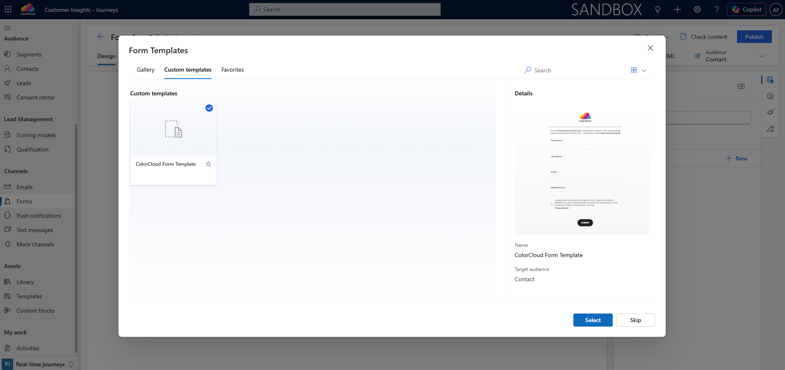

**Step 3. Enter form details**
- Use your user ID as a prefix when naming the form, **`{{Your user ID}} ColorCloud Newsletter Subscription`**. For example, if your user is colorcloud**01**@andrasfordos.onmicrosoft.com, name your form **`01 ColorCloud Newsletter Subscription`**. This is important because several users are working in the same environment.
- Review the initial structure inherited from the template

**Step 4. Review & update the form fields and elements**
- Confirm that the form is intended to capture the subscriber's email address. Click the `Email` field and review the Edit field section on the right side. Make sure the `Required` flag is `On` and, under `Advanced`, `Validation` is set to `Email`.
- Select `Mobile Phone` field, in the Edit field section on the right side set it as `Required` and, under `Advanced`, change `Validation` from `No validation` to `Phone number`
- Review whether the template already contains the required consent elements. Click the consent checkbox field and review the Edit purpose section on the right side. `Compliance profile` should be set to `ColorCloud Commercial DOI`, `Purpose` should be set to `Commercial`, `Required` should be `On`, and under `Properties`, `Update user's consent for both Email and Text` should be checked.
- Confirm that reCAPTCHA is placed on the form

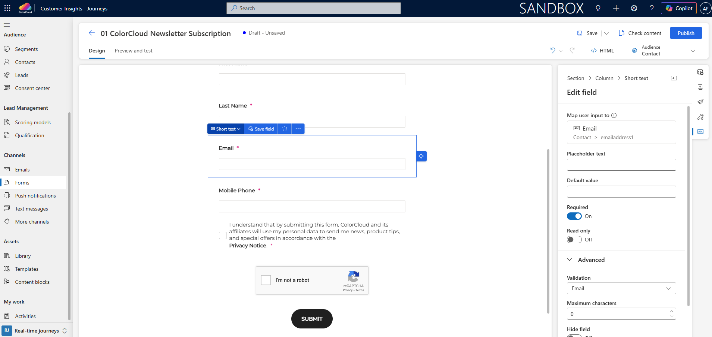

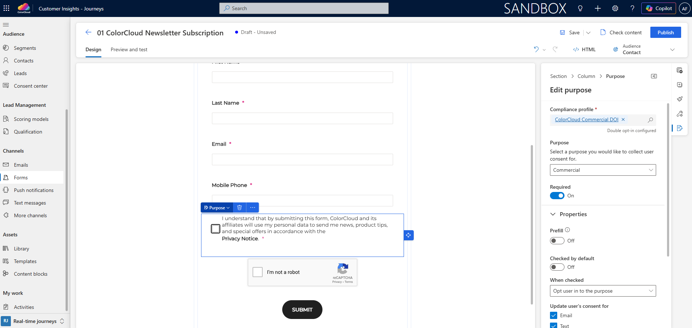

**Step 5. Review & update form settings**
- Check that the `Audience` is set to `Contact` in the top-right corner. This means that when the form is submitted and the email address is verified through the double opt-in email, a new Contact record will be created or an existing Contact record will be updated.
- In the icon menu on the right side of the Edit purpose section, click Form settings
- Expand the Audience section and check that `Choose how to handle duplicate contacts` is set to `Use a rule to match an existing contact` and `Select contact matching rule` is set to `Update contact using email`
- Expand the Consent section and check that `Double opt-in` is Enabled. It should be enabled because the compliance profile `ColorCloud Commercial DOI` is selected for the consent checkbox and it is the best practice to verify the email address from the form submission.
- Expand the Submission section and update the `Thank you notification` from `Thank you for your submission.` to `You are one click away from receiving your discount code! Please go into your mailbox and verify your email address.`

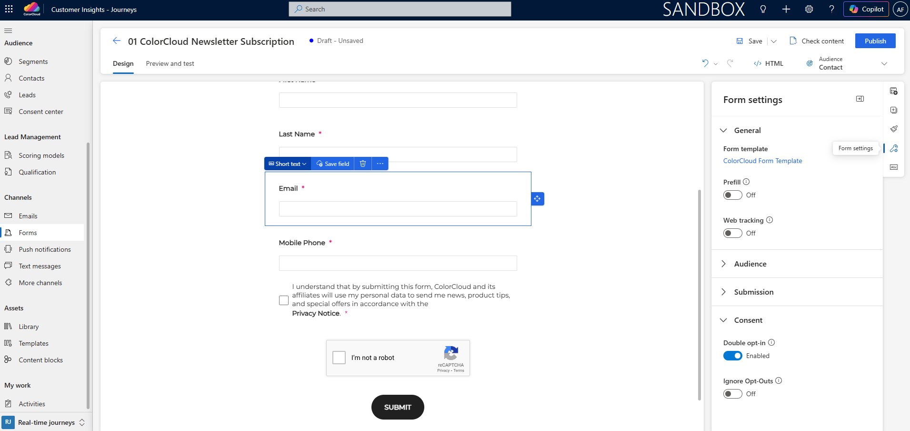

**Step 6. Save and publish the form**
- In the top-right corner click **Save**
- Then click **Publish**
- Wait until the form is published successfully
- Click Publish options and create a new standalone page. You can either copy the script to embed the form on your own website or use the Microsoft-hosted standalone page. If you finish this lab early, you can use the standalone page to test the form submission.

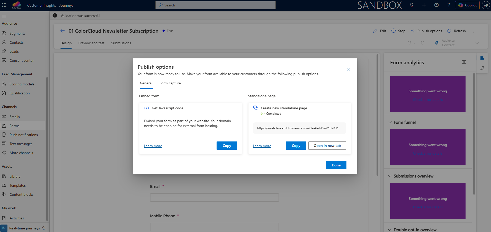

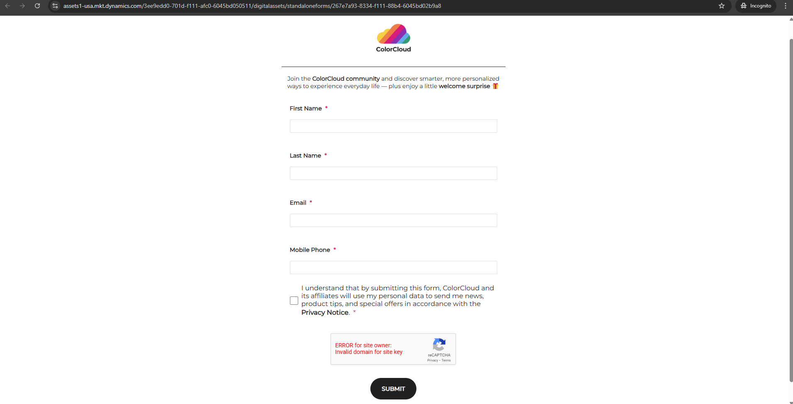

**Expected outcome**

You have created and published a form named **`{{Your user ID}} ColorCloud Newsletter Subscription`** based on the `ColorCloud Form Template`. The form is ready to be used in a trigger-based journey.

# Exercise 2: Build the subscription confirmation email
In this exercise, you will create the first marketing email in the ColorCloud scenario. This email confirms the newsletter subscription and delivers the promised discount code.

**Step 1. Go to Emails**
- In Customer Insights - Journeys, stay in the Real-time journeys area of `CI-J`
- In the left navigation, go to Channels > Emails

**Step 2. Create a new email from template**
- In the top command bar, select **+ New**
- In the Email Templates pop-up window, under Custom templates, click **`ColorCloud Email Template`** and click Select in the bottom-right corner

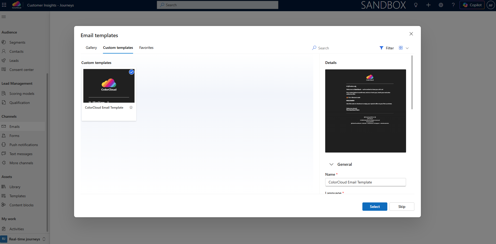

**Step 3. Enter email details**
- Use your user ID as a prefix when naming the email, **`{{Your user ID}} ColorCloud Newsletter Subscription Confirmation with Discount Code`**. For example, if your user is colorcloud**01**@andrasfordos.onmicrosoft.com, name your email **`01 ColorCloud Newsletter Subscription Confirmation with Discount Code`**.

**Step 4. Verify & update the email details**
- Confirm that the `Brand profile` in the top-right corner is set to `ColorCloud`
- Expand the email header and confirm that the `Sender` is `ColorCloud` and the `Subject` is `Welcome to ColorCloud – here's your exclusive offer 🎁`
- In the icon menu on the right side, click Personalize and check that under Dynamic text, `FirstName` is set to `Contact > First Name`. This means the value will be pulled from the Contact record for each recipient and matches the audience selected for the form.
- In the icon menu on the right side, click Settings, check that `Company address` is the same as the one you saw in the compliance profile in Lab 1, then expand Compliance and check that `Compliance profile` is set to `ColorCloud Commercial DOI` and change the `Purpose` from `Commercial` to `Transactional`. Since the discount code was promised after subscription, this email should be sent independently of commercial consent.
- In the body of the email, check the footer content block, you've classified the email as Transactional in the previous step, but the footer is for Commercial emails since it includes `Unsubcribe`
- Select the footer `Section` in the body of the email and click on Delete
- In the icon menu on the right side, click Content blocks, select `Transactional Footer` and add it to the bottom of the email by clicking on the plus sign

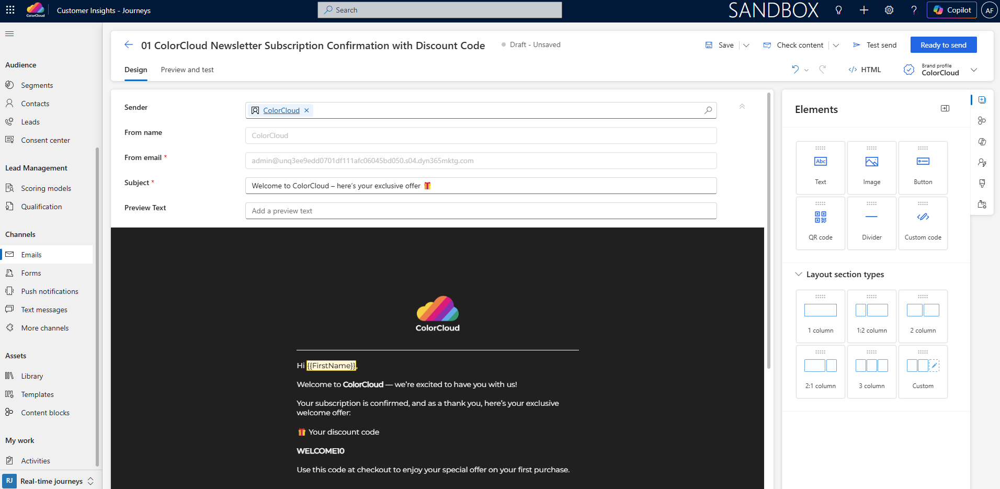

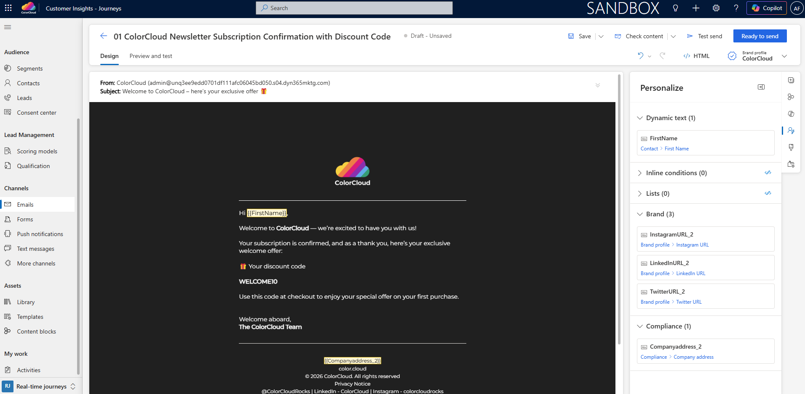

**Step 5. Save and publish the email**
- Once verified, click Save in the top-right corner and then click **Ready to send**
- Wait until the email is published successfully

**Expected outcome**

You have created an email named **`{{Your user ID}} ColorCloud Newsletter Subscription Confirmation with Discount Code`** and made it ready to send. The email is ready to be used in a real-time journey.

# Exercise 3: Build the trigger-based subscription incentive journey
In this exercise, you will create a trigger-based journey that starts when the newsletter subscription form is submitted. You will configure the form as the trigger condition, send the confirmation email, and set a goal to onboard new customers. Success for the journey will be reached when 1000 recipients open the email.

**Step 1. Go to Journeys**
- In Customer Insights - Journeys, stay in the Real-time journeys area of `CI-J`
- In the left navigation, go to Engagement > Journeys

**Step 2. Create a new trigger-based journey**
- In the top command bar, select **+ New journey**
- In the Create new journey pop-up window click Skip and create from blank in the bottom-right corner
- Use your user ID as a prefix when naming the journey, **`{{Your user ID}} ColorCloud Subscription Incentive`**. For example, if your user is colorcloud**01**@andrasfordos.onmicrosoft.com, name your journey **`01 ColorCloud Subscription Incentive`**.
- Choose **Trigger-based**
- Choose `Marketing Form Submitted` by starting to type in the Choose a trigger field
- Choose **`{{Your user ID}} ColorCloud Newsletter Subscription`** under Choose a form - leave empty for all forms
- Click Create in the bottom-right corner

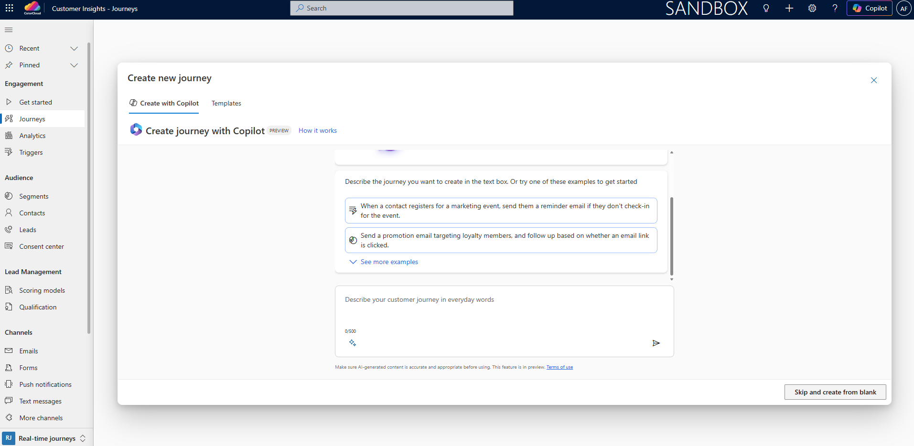

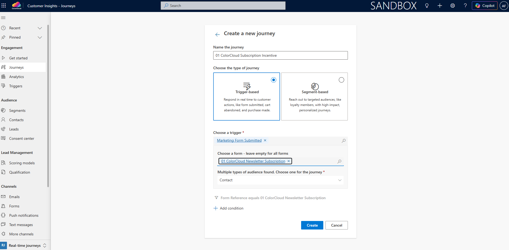

Optional: Check [Microsoft documentation](https://learn.microsoft.com/en-us/dynamics365/customer-insights/journeys/real-time-marketing-trigger-based-journey) to learn more about trigger-based journeys and triggers

**Step 6. Add the email**
- In the journey canvas, add an **Email** tile after Trigger: Marketing Form Submitted by clicking the plus sign Add an action and choosing Email (Send an email) in the pop-up window
- In the Email section on the right, choose **`{{Your user ID}} ColorCloud Newsletter Subscription Confirmation with Discount Code`** under Select email
- Click Save in the top-right corner

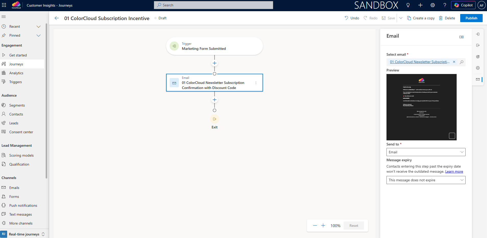

**Step 7. Configure the journey entry and goal**
- In the icon menu on the right side of the Email section click Entry, set Repeat to Never, and under Schedule choose the correct Time zone and Start
- In the icon menu on the right side of the Entry section click Goal, then select `Onboard new people` from The goal of this journey is
- Choose `Email Opened` for This goal is met when. Under The number of people needed, enter `1000` and select `#` instead of `%`. This is only an illustrative example for the workshop.
- Click Save in the top-right corner

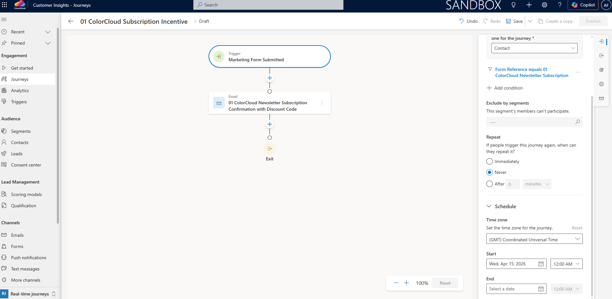

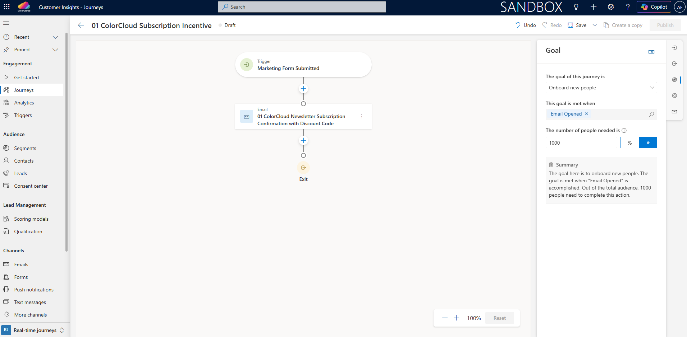

**Step 8. Publish the journey**
- Click **Publish** in the top-right corner
- Wait until the journey is published successfully

**Expected outcome**

You have created and published a trigger-based journey named **`{{Your user ID}} ColorCloud Subscription Incentive`**. The journey starts when someone submits the ColorCloud newsletter subscription form, verifies their email address through the double opt-in email, receives a confirmation email with a discount code, and is tracked toward the onboarding goal. The goal is considered achieved when `1000` recipients open the email.

# Lab Summary
In this lab, you created the first live interaction in Maya's ColorCloud journey. You built a subscription form, created a confirmation email with a discount code, and connected both assets through a trigger-based real-time journey in `CI-J`.

Consider where this journey fits in Maya Novak's experience:
  - Maya discovers ColorCloud online
  - She subscribes to receive a discount code via **`{{Your user ID}} ColorCloud Newsletter Subscription`** form
  - She receives the **`{{Your user ID}} ColorCloud Newsletter Subscription Confirmation with Discount Code`** email and discount code through the **`{{Your user ID}} ColorCloud Subscription Incentive`** journey
  - This becomes the starting point for her first purchase journey

You are now ready to continue with building Maya's ColorCloud customer experience in [Lab 3a: Build Segment-based Post-Purchase Onboarding & Upsell Journey](https://github.com/marianna-kozanyiova/colorclourd-26-unlock-e2e-cx-w-d365-ci-workshop/blob/main/lab03a.md).
