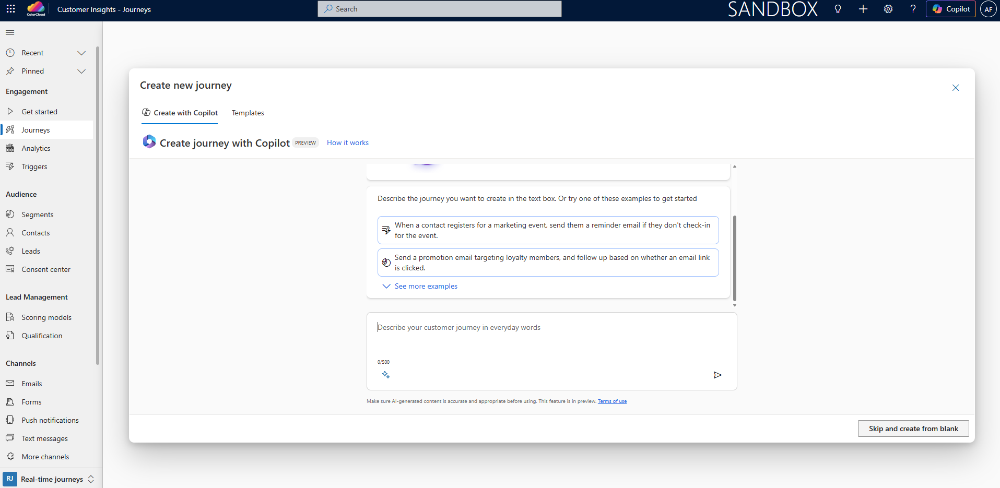
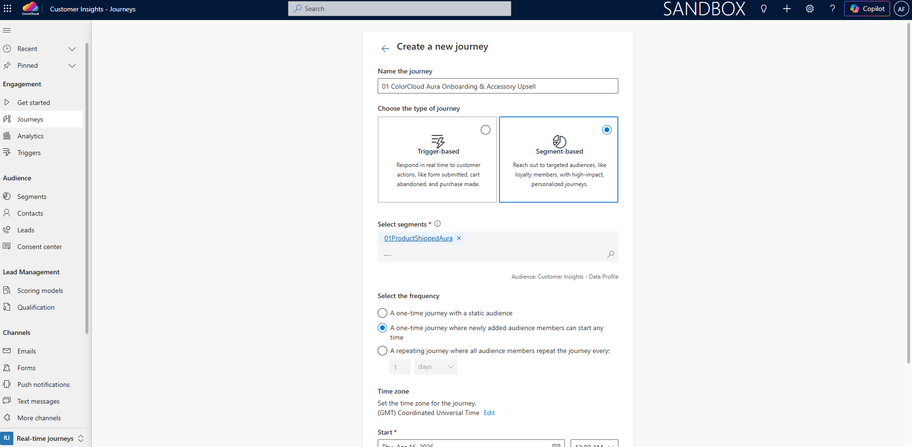
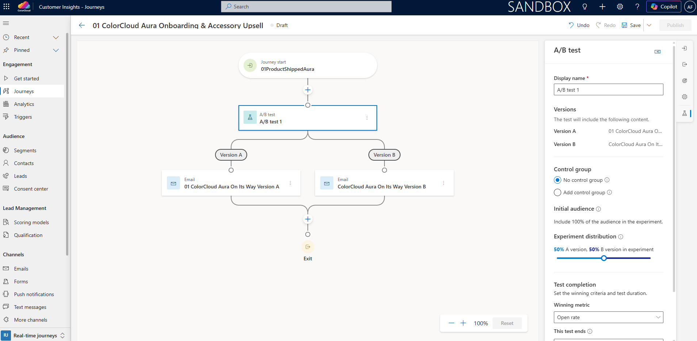
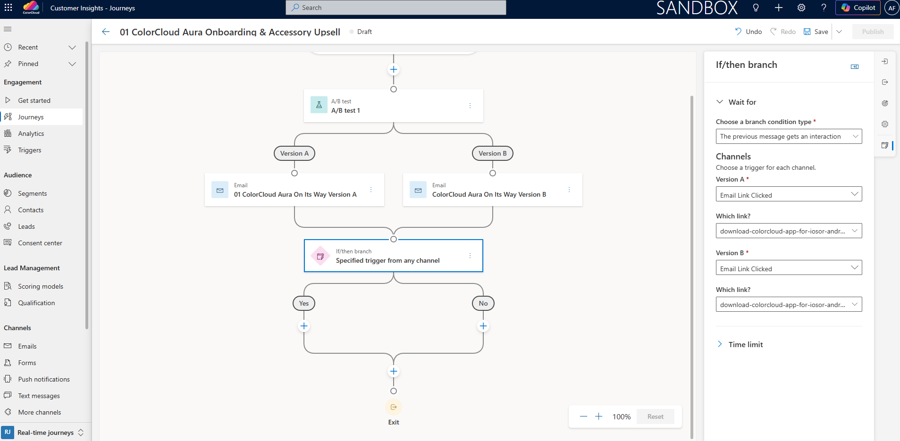
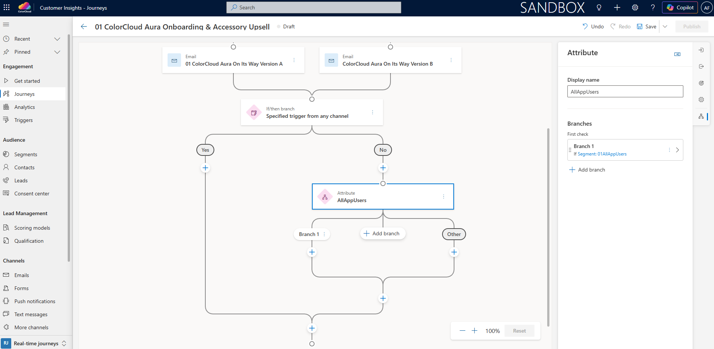
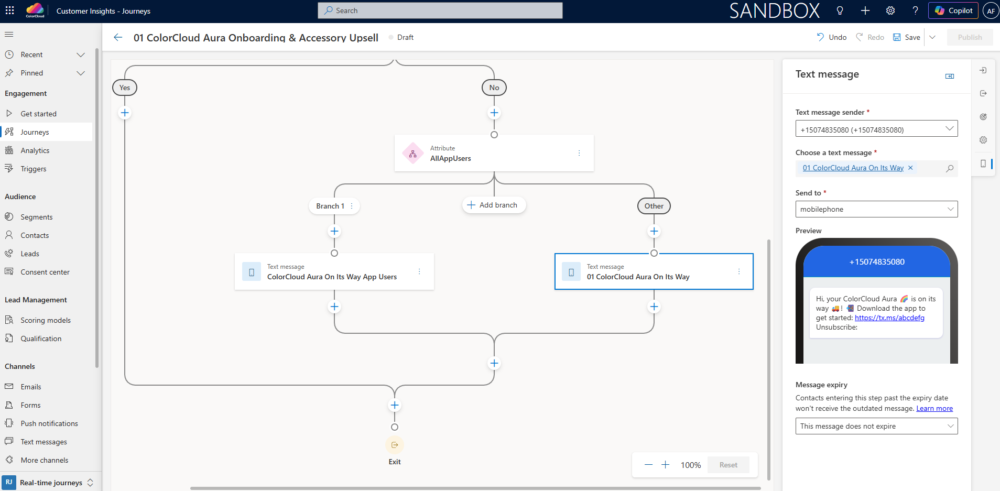
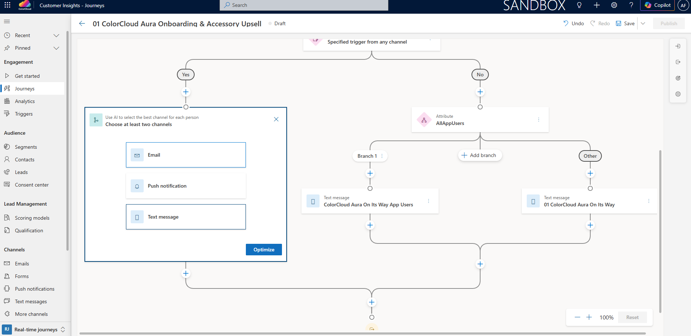
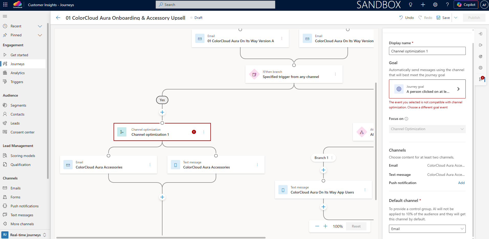
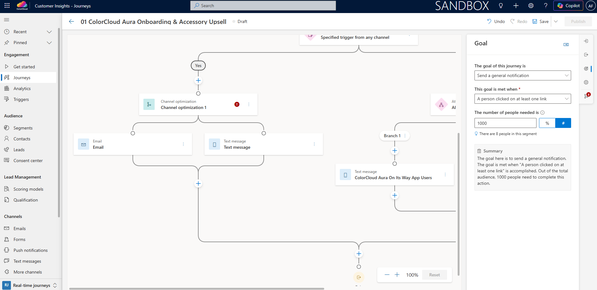

# Lab 03b: Build Segment-based Post-Purchase Onboarding & Upsell Journey

[Reading time: 5 min]

[Lab time: 20 min]

- [Exercise 3: Build the segment-based post-purchase onboarding and upsell journey](#exercise-3-build-the-segment-based-post-purchase-onboarding-and-upsell-journey)
- [Lab Summary](#lab-summary)

# Exercise 3: Build the segment-based post-purchase onboarding and upsell journey
In this exercise, you will create the main segment-based journey that orchestrates onboarding and upsell after Maya's purchase.

**Step 1. Create a new segment-based journey**
- In `CI-J`, stay in the Real-time journeys area
- In the left navigation, go to **Journeys**
- In the top command bar select **+ New journey**, then in the pop-up window click Skip and create from blank in the bottom-right corner

- Name the journey **`{{Your user ID}} ColorCloud Aura Onboarding & Accessory Upsell`** using your user ID prefix, the same as for the other elements you created
- Choose `Segment-based`, choose **`{{Your user ID}}ProductShippedAura`** under Select segments, choose `A one-time journey where newly added audience members can start any time` under Select the frequency, set the correct Time zone and Start, then click Create in the bottom-right corner

Optional: Check [Microsoft documentation](https://learn.microsoft.com/en-us/dynamics365/customer-insights/journeys/real-time-marketing-segment-based-journey?source=recommendations) to learn more about segment-based journeys

**Step 2. Add A/B test for onboarding email**
- In the journey canvas, click the plus sign. Under AI-powered actions, click A/B test (Text messages or channels against each other). Version A should be Email and Version B should be Email, then click Create test.
- Set up the A/B test under the A/B test section on the right side
    - Under Versions, select **`{{Your user ID}} ColorCloud Aura On Its Way Version A`** for Version A and `ColorCloud Aura On Its Way Version B` for Version B. If you leave the A/B test section, you can return by clicking the A/B test tile in the journey canvas.
    - Under Test completion, for Winning metric select `Open rate`
    - Keep the rest of the settings as they are. If you want to learn more about A/B testing, you can check the [Microsoft documentation](https://learn.microsoft.com/en-us/dynamics365/customer-insights/journeys/real-time-marketing-ab-tests-in-marketing-journeys).

**Step 3. Add branching based on the “Download the app” link click**
- After the A/B test path, click the plus sign Add an action in the journey canvas. Under Conditions, add Wait for trigger (Response to an audience action or update)
- Set up the branch under the If/then branch section on the right side
    - Select `Previous message gets an interaction` for Choose a branch condition type
    - Under both Versions A and B, select trigger `Email Link Clicked` and choose the `download-colorcloud-app-for-iosor-android` link
    - Under Time limit set `7 days`

**Step 6. Set up Email Link Clicked No path of the journey**
- After the If/then branch, click the plus sign Add an action on the No path. Under Conditions, add Attribute branch (Branch based on specific value)
- Enter `AllAppUsers` as Display name
- Under Branches, click Branch 1 If Add conditions > Make condition on segment membership > `Is in segment` > **`{{Your user ID}}AllAppUsers`**
- In the journey canvas under Branch 1, click the plus sign Add an action. Under Messages, add Text message (Send a text message (SMS)) and choose `ColorCloud Aura On Its Way App Users`. This message informs customers who already use the app that the product was shipped.
- In the journey canvas under Other, click the plus sign Add an action. Under Messages, add Text message (Send a text message (SMS)) and choose **`{{Your user ID}} ColorCloud Aura On Its Way`**. This message informs customers who are not yet app users that the product was shipped and prompts them to download the app.

**Step 7. Set up Email Link Clicked Yes path of the journey incl. AI channel optimization**
- After the If/then branch, click the plus sign Add an action on the Yes path. Under AI-powered actions, add Channel optimization (Use AI to select the best channel for each person)
- Choose Email and Text message, then click Optimize
- Under the Channel optimization section on the right side, set up Journey goal > select `Send a general notification` under The goal of this journey is > select `A person clicked on at least one link` under This goal is met when > under The number of people needed enter `1000` and select `#` instead of `%`
- In the journey canvas click the Channel optimization tile, scroll down to Default channel, and select Email
- In the journey canvas click the Email tile under Channel optimization and choose `ColorCloud Aura Accessories` email
- In the journey canvas click the Text message tile under Channel optimization and choose `ColorCloud Aura Accessories` text message

**Step 8. Save & publish the journey**
- In the top-right corner click Save, and once saved, click Publish
- Wait until the journey is Live

**Expected outcome**

You have created and published **`{{Your user ID}} ColorCloud Aura Onboarding & Accessory Upsell`**. The journey starts from the **`{{Your user ID}}ProductShippedAura`** segment, tests two onboarding email variants, branches on the **Download the app** link click, uses channel optimization for engaged customers to drive accessory upsell, and sends a text message reminder to non-clickers depending on their **`{{Your user ID}}AllAppUsers`** segment membership.

# Lab Summary
In this lab, you extended Maya Novak's ColorCloud journey beyond the first purchase. You created two `CI-D` segments to identify shipped-product customers and app users, updated the onboarding email with personalization and conditional content, prepared email and SMS assets, and built a segment-based journey in `CI-J`.

Consider where this journey fits in Maya Novak's experience:
- Maya has already subscribed and completed her first purchase
- Her ColorCloud Aura product is shipped
- She enters the onboarding journey through the **`{{Your user ID}}ProductShippedAura`** segment
- She receives an onboarding email that is part of an A/B test
- Her next step depends on whether she clicked the **Download the app** link
- She can then continue into a more optimized onboarding and upsell experience across email and SMS

You are now ready to continue with building Maya's ColorCloud customer experience in [Lab 04 - Optional: Build Segment-based First Use Feedback Journey](https://github.com/marianna-kozanyiova/colorclourd-26-unlock-e2e-cx-w-d365-ci-workshop/blob/main/lab04-optional.md).
