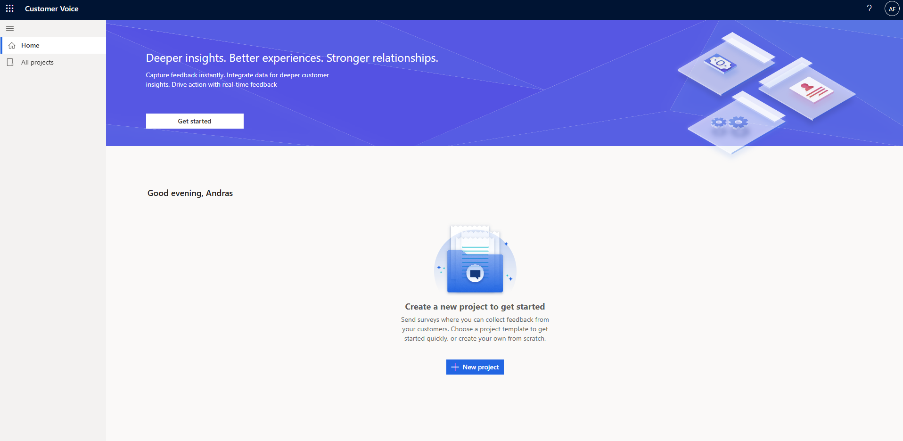
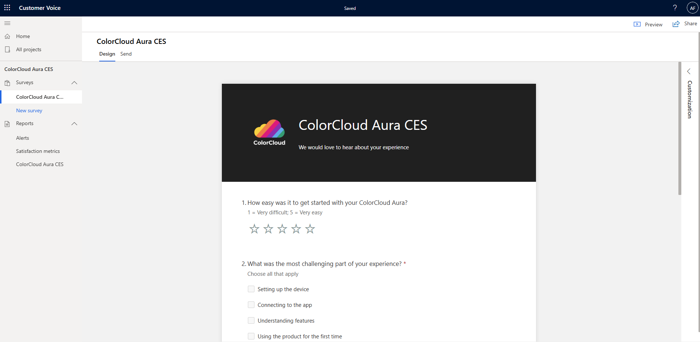
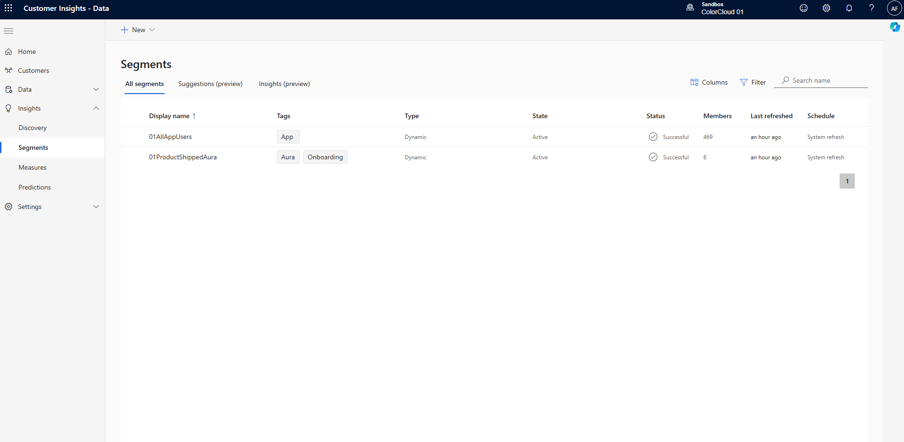
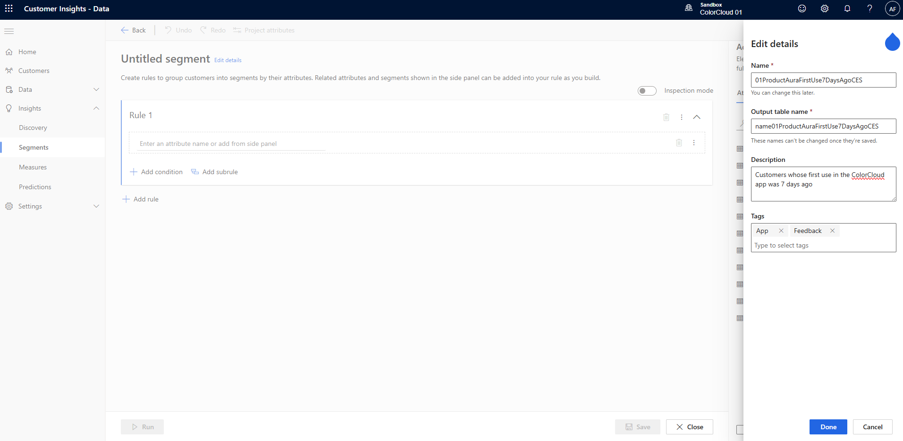
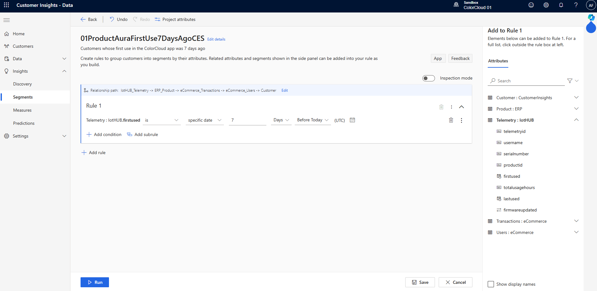
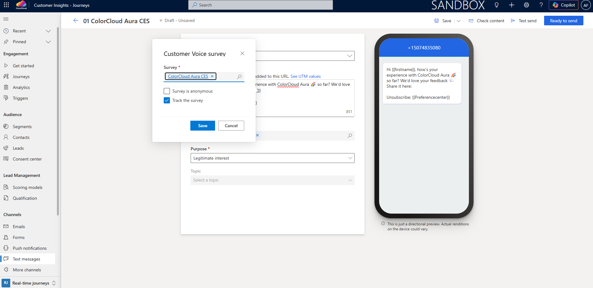
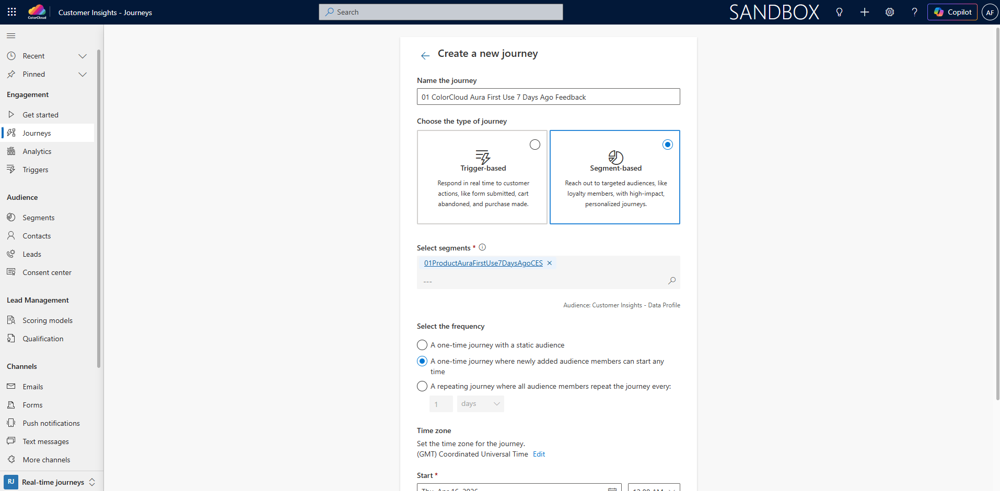
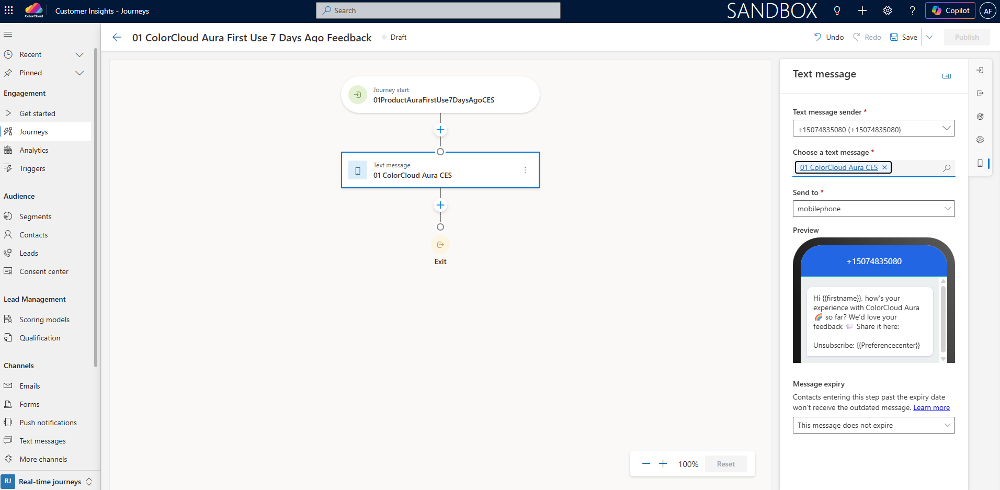

# Lab 04 - Optional: Build Segment-based First Use Feedback Journey

[Reading time: 5 min]

[Lab time: 15 min]

- [Lab Overview](#lab-overview)
- [Exercise 1: Review the Customer Voice survey](#exercise-1-review-the-customer-voice-survey)
- [Exercise 2: Build the CI-D segment for recent first app use](#exercise-2-build-the-ci-d-segment-for-recent-first-app-use)
- [Exercise 3: Add the survey to text message and build the segment-based first use feedback journey](#exercise-3-add-the-survey-to-text-message-and-build-the-segment-based-first-use-feedback-journey)
- [Lab Summary](#lab-summary)

# Lab Overview
## Introduction
In this lab, you will continue Maya Novak's ColorCloud experience after she has received her product and started using it in the ColorCloud mobile app. You will first sign in to `Customer Voice` to review the survey project and survey prepared for you. Then you will move to `CI-D`, where you will create a segment of customers whose first use in the app happened 7 days ago. Finally, you will switch to `CI-J`, where you will add the survey to a text message and build a segment-based journey to send it.

This journey is designed to collect early feedback shortly after first product use, while the experience is still fresh in the customer's mind. In the ColorCloud scenario, this is the moment when Maya is invited to share how easy it was to get started with her new ColorCloud Aura product.

## Objectives
By the end of this lab, you will be able to:
- Use a `Customer Voice` survey in `CI-J`

# Exercise 1: Review the Customer Voice survey
In this exercise, you will sign in to Customer Voice and review the survey project and survey that were already prepared for the workshop.

**Step 1. Open Customer Voice**
- In your browser window, open a new tab and enter https://customervoice.microsoft.com/
- Sign in with your workshop credentials, the same way you did for `CI-J`

**Step 2. Review the survey project and survey**
- In Customer Voice, go to All projects
- Under My projects you should see a project named `ColorCloud Aura CES` (`Customer Effort Score`). Open the project.
- Confirm that the project contains the `ColorCloud Aura CES` survey with `3` questions

Optional: Check [Microsoft documentation](https://learn.microsoft.com/en-us/dynamics365/customer-voice/about) to learn more about Customer Voice

**Expected outcome**

You have successfully signed in to Customer Voice and reviewed the preconfigured survey project and survey that will be used for the first use feedback journey.

# Exercise 2: Build the CI-D segment for recent first app use
In this exercise, you will work in `CI-D` to create a segment of customers whose first use in the app happened 7 days ago.

**Step 1. Open Customer Insights - Data**
- Open the `CI-D` environment you verified in Lab 1 and used in Lab 2
- In the left navigation, go to Insights > **Segments**

**Step 2. Create a ProductAuraFirstUse7DaysAgoCES segment**
- At the top command bar, click **+ New** > Build your own
- Click Edit details next to Untitled segment
- Name the segment **`{{Your user ID}}ProductAuraFirstUse7DaysAgoCES`** using your user ID prefix
- Enter a description that clearly explains the purpose of the segment, for example: Customers whose first use in the ColorCloud app was 7 days ago
- Add tags that help identify the purpose of the segment, for example:
  - App
  - Feedback
- Click Done in the bottom-right corner

- In the right navigation, on the Attributes tab, expand `Telemetry : IotHUB`, select `firstused` to add it to the segment logic builder canvas, click the two horizontal arrows next to the `Use time (UTC)` checkbox, and enter `7 Days Before Today`
- At the top of the logic Rule 1 block, click Set relationship path and choose `IotHUB_Telemetry > ERP_Product > eCommerce_Transactions > eCommerce_Users > Customer`, then click Done
- In the bottom-right corner click Save, then in the bottom-left corner click Run

**Step 3. Verify the segment status**
- Back in the Segments overview, verify that the **`{{Your user ID}}ProductAuraFirstUse7DaysAgoCES`** segment has status Queued, Refreshing, or Successful

**Expected outcome**

You have created a `CI-D` segment named **`{{Your user ID}}ProductAuraFirstUse7DaysAgoCES`** that identifies customers whose first use in the app was 7 days ago.

# Exercise 3: Add the survey to text message and build the segment-based first use feedback journey
In this exercise, you will work in `CI-J` to update the text message that will be used to send the feedback survey.

**Step 1. Finalize ColorCloud Aura CES Text message**
- In `CI-J`, make sure you are in the Real-time journeys area
- In the left navigation, go to **Channels > Text messages**
- Open `ColorCloud Aura CES`, which is in Draft state, click the drop-down next to Save in the top-right corner, and select Save as
- Add your user ID prefix to the Name and delete Copy from the end of the name, naming the text message **`{{Your user ID}} ColorCloud Aura CES`**, then click Save in the top-right corner
- In the Message window, place your cursor after the text `Share it here:` and click the `Customer Voice` icon at the bottom of the Message field > select `ColorCloud Aura CES` > Save
- Verify that `Compliance profile` is set to `ColorCloud Legitimate Interest` and `Purpose` is set to `Legitimate Interest`. In some locations, feedback requests can be sent based on legitimate interest, but recipients must still have the option to opt out.
- In the top-right corner click Save, and once saved, click Ready to send

Optional: Check [Microsoft documentation](https://learn.microsoft.com/en-us/dynamics365/customer-insights/journeys/real-time-marketing-text-messaging#add-a-customer-voice-survey-to-a-text-message) to see how to add a Customer Voice survey to a text message

**Step 2. Create a new segment-based journey**
- In `CI-J`, stay in the Real-time journeys area
- In the left navigation, go to Journeys
- In the top command bar select + New journey, then in the pop-up window click Skip and create from blank in the bottom-right corner
- Name the journey **`{{Your user ID}} ColorCloud Aura First Use 7 Days Ago Feedback`** using your user ID prefix, the same as for the other elements you created
- Choose `Segment-based`, choose **`{{Your user ID}}ProductAuraFirstUse7DaysAgoCES`** under Select segments, choose `A one-time journey where newly added audience members can start any time` under Select the frequency, set the correct Time zone and Start, then click Create in the bottom-right corner

- In the journey canvas, click the plus sign, under Messages add Text message (Send a text message (SMS)), and choose **`{{Your user ID}} ColorCloud Aura CES`**
- In the top-right corner click Save, and once saved, click Publish
- Wait until the journey is Live

**Expected outcome**

You have created and published **`{{Your user ID}} ColorCloud Aura First Use 7 Days Ago Feedback`** journey where the journey starts from the **`{{Your user ID}}ProductAuraFirstUse7DaysAgoCES`** `CI-D` segment and sends the **`{{Your user ID}} ColorCloud Aura CES`** text message with the embedded `Customer Voice` survey.

# Lab Summary
In this lab, you extended Maya Novak's ColorCloud journey into the feedback stage. You reviewed the preconfigured `Customer Voice` survey, created a `CI-D` segment for customers whose first app use happened 7 days ago, updated the feedback text message with the survey link, and built a segment-based journey in `CI-J` to send it.

Consider where this journey fits in Maya Novak's experience:
- Maya has already received her ColorCloud Aura product
- She has used the product in the app for the first time
- She enters the feedback journey through the **`{{Your user ID}}ProductAuraFirstUse7DaysAgoCES`** segment
- She receives the **`{{Your user ID}} ColorCloud Aura CES`** text message with a Customer Voice survey through the **`{{Your user ID}} ColorCloud Aura First Use 7 Days Ago Feedback`** journey
- Her feedback can now be used to measure early onboarding success and customer experience

You are now ready to continue with [Lab 05: Measure Customer Value and Adoption](https://github.com/marianna-kozanyiova/colorclourd-26-unlock-e2e-cx-w-d365-ci-workshop/blob/main/lab05.md), where you will use Customer Insights - Data to measure customer value and adoption and identify high-value adopters in the ColorCloud scenario.
